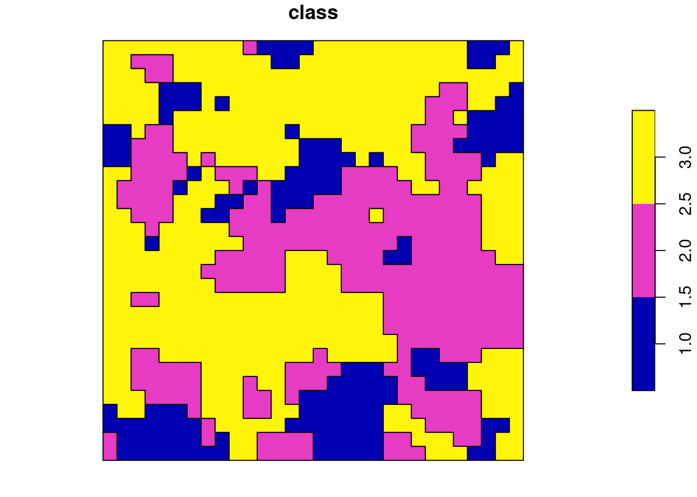
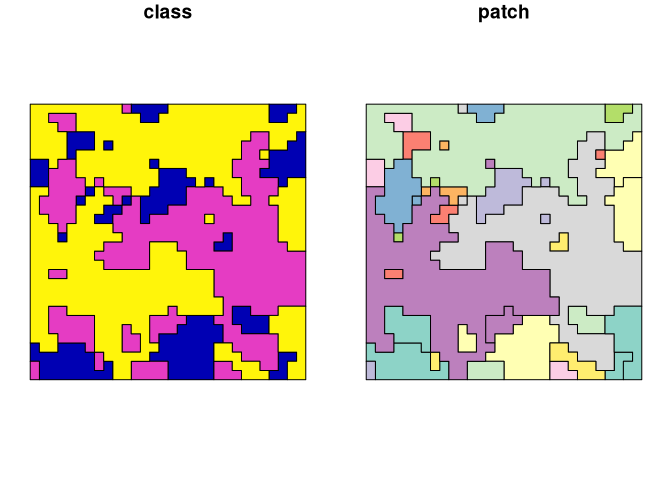

<!-- To render, run:
Sys.setenv(RSTUDIO_PANDOC = "C:/Program Files/RStudio/resources/app/bin/quarto/bin/tools")
rmarkdown::render("README.Rmd")
-->
<!-- README.md is generated from README.Rmd. Please edit that file -->

# vectormetrics

<!-- badges: start -->

[](https://lifecycle.r-lib.org/articles/stages.html#experimental)
[](https://app.codecov.io/gh/r-spatialecology/vectormetrics?branch=main)
[](https://github.com/r-spatialecology/vectormetrics/actions/workflows/R-CMD-check.yaml)
<!-- badges: end -->

## Overview

`vectormetrics` is an R package for calculating landscape and shape
metrics for vector layers. Its aim is to provide a set of metrics that
can characterize landscape patterns and properties of the shapes defined
as polygons and multipolygons. Whole package is based on Simple Feature
geometry standard provided by **sf** package. Every function can be used
in a tidy, piped workflow, as it always takes the data as the first
argument and returns a `tibble`.

## Installation

<!--You can install the released version of `vectormetrics` from [CRAN](https://CRAN.R-project.org) with:
&#10;
```r
install.packages("vectormetrics")
```
-->

You can download most recent development version of the package from
GitHub with:

``` r
remotes::install_github("r-spatialecology/vectormetrics")
```

## Using vectormetrics

### Function names structure

All functions in `vectormetrics` start with *vm\_* (for vector metrics).
The second part of the name specifies the level (patch - *p*, class -
*c* or landscape - *l*). The last part of the function name is the
abbreviation of the corresponding metric (e.g. *enn* for the euclidean
nearest-neighbor distance and *rect* for the rectangularity). Some
landscape and class level functions have also a suffix at the end, that
specifies the aggregation method (e.g. *mean*, *sd*).

``` r
# Patch level
## vm_p_"metric"
vm_p_area()
vm_p_square()

# Class level
## vm_c_"metric"[_"aggregation"]
vm_c_np()
vm_c_shape_sd()

# Landscape level
## vm_l_"metric"[_"aggregation"]
vm_l_lpi()
vm_l_square_mn()
```

### Examples

Some examples of calculating metrics on all levels and with different
class and patch columns.

``` r
library(vectormetrics)
library(sf)
data("vector_landscape")
plot(vector_landscape)
```



``` r
## Shape index
vm_p_shape(vector_landscape, class_col = "class")
#> MULTIPOLYGON geometry provided. You may want to cast it to separate polygons with 'get_patches()'.
#> MULTIPOLYGON geometry provided. You may want to cast it to separate polygons with 'get_patches()'.
#> MULTIPOLYGON geometry provided. You may want to cast it to separate polygons with 'get_patches()'.
#> MULTIPOLYGON geometry provided. You may want to cast it to separate polygons with 'get_patches()'.
#> # A tibble: 3 × 5
#>   level class id    metric value
#>   <chr> <chr> <chr> <chr>  <dbl>
#> 1 patch 1     1     shape   5.06
#> 2 patch 2     2     shape   4.76
#> 3 patch 3     3     shape   4.80

## Number of patches
vm_c_np(vector_landscape, class_col = "class")
#> MULTIPOLYGON geometry provided. You may want to cast it to separate polygons with 'get_patches()'.
#> # A tibble: 3 × 5
#>   level class id    metric value
#>   <chr> <chr> <chr> <chr>  <int>
#> 1 class 1     <NA>  np         1
#> 2 class 2     <NA>  np         1
#> 3 class 3     <NA>  np         1

## Largest patch index
vm_l_lpi(vector_landscape)
#> MULTIPOLYGON geometry provided. You may want to cast it to separate polygons with 'get_patches()'.
#> # A tibble: 1 × 5
#>   level     class id    metric value
#>   <chr>     <chr> <chr> <chr>  <dbl>
#> 1 landscape <NA>  <NA>  lpi     49.7

## Mean squareness
vm_l_square_mn(vector_landscape)
#> MULTIPOLYGON geometry provided. You may want to cast it to separate polygons with 'get_patches()'.
#> MULTIPOLYGON geometry provided. You may want to cast it to separate polygons with 'get_patches()'.
#> MULTIPOLYGON geometry provided. You may want to cast it to separate polygons with 'get_patches()'.
#> # A tibble: 1 × 5
#>   level     class id    metric value
#>   <chr>     <chr> <chr> <chr>  <dbl>
#> 1 landscape <NA>  <NA>  sq_mn  0.232
```

### Utility functions

For now there are two utility functions available in the package. First
one is `get_patches()` which breaks multipolygon geometries into
polygons. There are two types of neighborhood relations available: 4
(edge) and 8 (vertex). This function enables users to create set of
geometries from aggregated shapes and analyze each shape’s properties
separately.

``` r
vector_patches = get_patches(vector_landscape, class_col = "class", direction = 4)
vector_patches
#> Simple feature collection with 40 features and 2 fields
#> Geometry type: POLYGON
#> Dimension:     XY
#> Bounding box:  xmin: 0 ymin: 0 xmax: 30 ymax: 30
#> CRS:           NA
#> First 10 features:
#>    class patch                       geometry
#> 1      1     1 POLYGON ((1 2, 0 2, 0 3, 0 ...
#> 2      1     2 POLYGON ((14 5, 15 5, 16 5,...
#> 3      1     3 POLYGON ((12 18, 12 19, 12 ...
#> 4      1     4 POLYGON ((10 19, 10 18, 9 1...
#> 5      1     5 POLYGON ((5 20, 6 20, 6 19,...
#> 6      1     6 POLYGON ((6 21, 7 21, 7 20,...
#> 7      1     7 POLYGON ((3 16, 4 16, 4 15,...
#> 8      1     8 POLYGON ((2 24, 2 23, 2 22,...
#> 9      1     9 POLYGON ((10 20, 11 20, 11 ...
#> 10     1    10 POLYGON ((13 24, 14 24, 14 ...

vector_patches |>
  dplyr::mutate(patch = as.factor(patch)) |>
  plot()
```



``` r

## Shape index
vm_p_shape(vector_patches, class_col = "class", patch_col = "patch")
#> # A tibble: 40 × 5
#>    level class id    metric value
#>    <chr> <chr> <chr> <chr>  <dbl>
#>  1 patch 1     1     shape   1.66
#>  2 patch 1     2     shape   1.37
#>  3 patch 1     3     shape   1.51
#>  4 patch 1     4     shape   1.41
#>  5 patch 1     5     shape   1.13
#>  6 patch 1     6     shape   1.13
#>  7 patch 1     7     shape   1.13
#>  8 patch 1     8     shape   1.15
#>  9 patch 1     9     shape   1.13
#> 10 patch 1     10    shape   1.13
#> # ℹ 30 more rows

## Number of patches
vm_c_np(vector_patches, class_col = "class")
#> # A tibble: 3 × 5
#>   level class id    metric value
#>   <chr> <chr> <chr> <chr>  <int>
#> 1 class 1     <NA>  np        19
#> 2 class 2     <NA>  np        14
#> 3 class 3     <NA>  np         7

## Mean squareness
vm_l_square_mn(vector_patches)
#> # A tibble: 1 × 5
#>   level     class id    metric value
#>   <chr>     <chr> <chr> <chr>  <dbl>
#> 1 landscape <NA>  <NA>  sq_mn  0.845
```

Another utility function is `get_axes()` which calculates the length of
the major and minor axes of the shape. It is used to calculate the
elongation metric in `vm_p_elong()` but since length of axes might be
useful information itself, `get_axes()` was exported as a separate
function.

``` r
get_axes(vector_patches, class_col = "class")
#> # A tibble: 40 × 6
#>    level class id    metric    major minor
#>    <chr> <chr> <chr> <chr>     <dbl> <dbl>
#>  1 patch 1     1     main_axes 10.8   5.28
#>  2 patch 1     2     main_axes  9.64  7.84
#>  3 patch 1     3     main_axes  8.38  5.16
#>  4 patch 1     4     main_axes  3.6   2.22
#>  5 patch 1     5     main_axes  1.42  1.42
#>  6 patch 1     6     main_axes  1.42  1.42
#>  7 patch 1     7     main_axes  1.42  1.42
#>  8 patch 1     8     main_axes  4.24  2.82
#>  9 patch 1     9     main_axes  1.42  1.42
#> 10 patch 1     10    main_axes  1.42  1.42
#> # ℹ 30 more rows
```

## Contributing

This is an experimental version of the package, so any feedback and
contributions in the form of pull requests are welcome.
