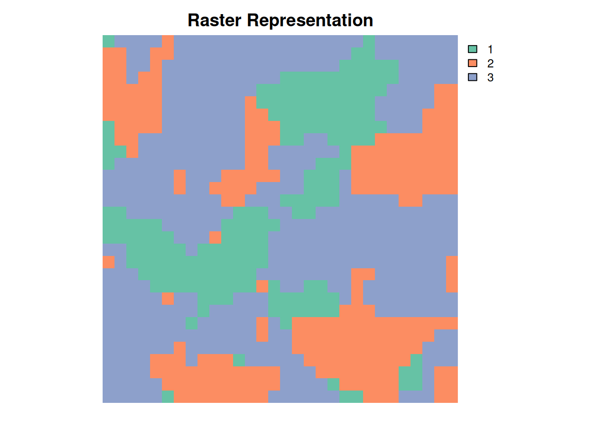
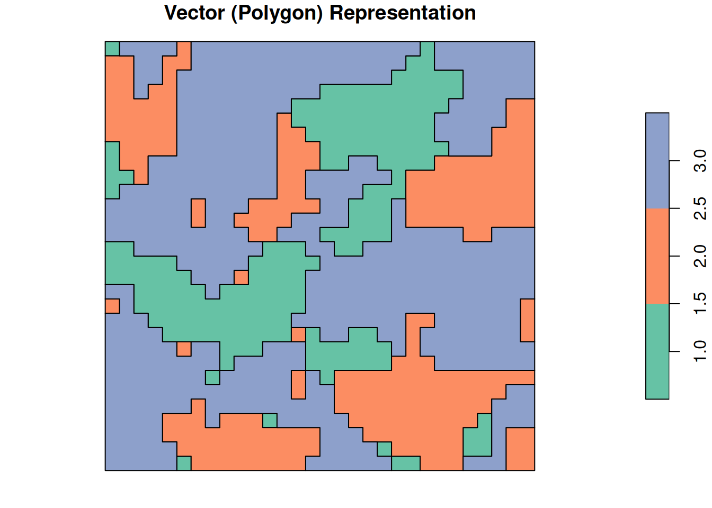

# Comparing metrics between vectormetrics and landscapemetrics R packages

## 1 Introduction

The **vectormetrics** package calculates landscape metrics based on
vector polygon representations. It shares many metrics with the
**landscapemetrics** package which offers landscape metrics for raster
data. In principle, both packages should produce similar or nearly
identical results as long as the input data is equivalent (e.g., raster
and vector representations of the exact polygon geometry). However,
differences can arise due to several factors, including computational
approaches, treatment of polygon boundaries, and underlying assumptions
about how landscape features are measured.

This comparison uses the
[`landscapemetrics::landscape`](https://r-spatialecology.github.io/landscapemetrics/reference/landscape.html)
dataset, a 30×30 cell raster at 1m resolution containing 3 classes
across 28 patches (9 patches in class 1, 13 in class 2, and 6 in class
3). The same landscape was converted to vector polygons for comparison.

> **Note**: When converting polygon data to raster for analysis with
> **landscapemetrics**, the rasterization process affects the actual
> landscape structure. Coarser resolutions can eliminate small patches
> entirely, merge adjacent patches, and distort patch boundaries –
> fundamentally changing what is measured. These structural changes
> cascade through all dependent metrics: patch counts change, patch
> areas and shapes shift, which then affects perimeter-based metrics
> (te, ed, shape, circle, lsi), distance calculations (enn, proximity),
> and core area detection (cai, dcore). This vignette uses an idealized
> scenario in which we have exactly the same landscape in both formats
> to show the pure representation difference – but in practice,
> converting your polygons to raster will change the landscape structure
> and thus the metrics you get.





## 2 Summary of comparison

This comparison evaluates **78 metrics** that exist in both packages,
organized across three analysis levels:

- **Patch level**: 9 metrics
- **Class level**: 39 metrics  
- **Landscape level**: 30 metrics

Beyond these shared metrics, **vectormetrics** offers **61 exclusive
metrics** not found in **landscapemetrics** – primarily specialized
shape complexity and geometry measures suited to vector polygon
analysis.

## 3 Metrics with perfect or near-perfect agreement

Many metrics show perfect or near-perfect agreement, with absolute
differences less than 0.001 on our test landscape. These metrics are
robust to the vector-raster representation difference because they rely
on count-based, proportion-based, or compositional calculations that
behave consistently across representations. When patches agree at the
patch level, those agreements propagate to class and landscape levels
since higher levels aggregate patch-level data.

### 3.1 Patch level: metrics with close agreement

Code

``` r
patch_close <- patch_metrics |>
  filter(abs_diff < 0.001, class == 1) |>
  group_by(metric_name) |>
  ungroup() |>
  select(metric_name, class, n_patches_vm, n_patches_lsm, value_vm, value_lsm, abs_diff, vm_units) |>
  arrange(metric_name)

kable(
  patch_close,
  digits = 3,
  caption = sprintf("Patch-level metrics with close agreement: %d unique metrics", 
                    n_distinct(patch_close$metric_name)),
  col.names = c("Metric", "Class", "N Patches VM", "N Patches LSM", "VM Value", "LSM Value", "Abs Diff", "Units")
)
```

| Metric  | Class | N Patches VM | N Patches LSM | VM Value | LSM Value | Abs Diff | Units                 |
|:--------|:------|-------------:|--------------:|---------:|----------:|---------:|:----------------------|
| p_area  | 1     |            9 |             9 |    0.002 |     0.002 |        0 | hectares              |
| p_core  | 1     |            9 |             9 |    0.001 |     0.001 |        0 | hectares              |
| p_frac  | 1     |            9 |             9 |    1.218 |     1.218 |        0 | index (dimensionless) |
| p_perim | 1     |            9 |             9 |   21.556 |    21.556 |        0 | meters                |

Patch-level metrics with close agreement: 4 unique metrics

4 patch-level metrics show close agreement across all patches within
class 1. These foundational patch-level agreements are carried forward
to higher aggregation levels. Note that `p_core` are idential because we
use the same core distance threshold – but in practice, differences in
core area detection methods (buffer vs. erosion) can lead to differences
in core area metrics.

### 3.2 Class level: metrics with close agreement

Code

``` r
class_close <- class_metrics |>
  filter(abs_diff < 0.001, class == 1) |>
  group_by(metric_name) |>
  ungroup() |>
  select(metric_name, class, value_vm, value_lsm, abs_diff, vm_units) |>
  arrange(metric_name)

kable(
  class_close,
  digits = 3,
  caption = sprintf("Class-level metrics with close agreement: %d unique metrics (class 1 shown)", 
                    n_distinct(class_close$metric_name)),
  col.names = c("Metric", "Class", "VM Value", "LSM Value", "Abs Diff", "Units")
)
```

| Metric     | Class |  VM Value | LSM Value | Abs Diff | Units                  |
|:-----------|:------|----------:|----------:|---------:|:-----------------------|
| c_area_cv  | 1     |   156.026 |   156.026 |        0 | percent (%)            |
| c_area_mn  | 1     |     0.002 |     0.002 |        0 | hectares               |
| c_area_sd  | 1     |     0.003 |     0.003 |        0 | hectares               |
| c_ca       | 1     |     0.018 |     0.018 |        0 | hectares               |
| c_core_mn  | 1     |     0.001 |     0.001 |        0 | hectares               |
| c_core_sd  | 1     |     0.001 |     0.002 |        0 | hectares               |
| c_division | 1     |     0.985 |     0.985 |        0 | index (dimensionless)  |
| c_frac_cv  | 1     |    17.924 |    17.924 |        0 | percent (%)            |
| c_frac_mn  | 1     |     1.218 |     1.218 |        0 | index (dimensionless)  |
| c_frac_sd  | 1     |     0.218 |     0.218 |        0 | index (dimensionless)  |
| c_lpi      | 1     |     8.889 |     8.889 |        0 | percent (%)            |
| c_mesh     | 1     |     0.001 |     0.001 |        0 | hectares               |
| c_np       | 1     |     9.000 |     9.000 |        0 | count                  |
| c_pd       | 1     | 10000.000 | 10000.000 |        0 | count per 100 hectares |
| c_pland    | 1     |    20.444 |    20.444 |        0 | percent (%)            |
| c_shape_cv | 1     |    25.323 |    25.323 |        0 | percent (%)            |
| c_split    | 1     |    68.056 |    68.056 |        0 | index (dimensionless)  |

Class-level metrics with close agreement: 17 unique metrics (class 1
shown)

17 class-level metrics show close agreement (class 1 shown). Class-level
agreement reflects the patch-level patterns, since class metrics
aggregate across patches within each class.

### 3.3 Landscape level: metrics with close agreement

Code

``` r
landscape_close <- landscape_metrics |>
  filter(abs_diff < 0.001) |>
  select(metric_name, value_vm, value_lsm, abs_diff, vm_units) |>
  distinct(metric_name, .keep_all = TRUE) |>
  arrange(metric_name)

kable(
  landscape_close,
  digits = 3,
  caption = sprintf("Landscape-level metrics with close agreement (abs_diff < 0.001): %d metrics", 
                    nrow(landscape_close)),
  col.names = c("Metric", "VM Value", "LSM Value", "Abs Diff", "Units")
)
```

| Metric      |  VM Value | LSM Value | Abs Diff | Units                  |
|:------------|----------:|----------:|---------:|:-----------------------|
| l_area_mn   |     0.003 |     0.003 |    0.000 | hectares               |
| l_circle_mn |     0.537 |     0.538 |    0.001 | index (dimensionless)  |
| l_core_mn   |     0.001 |     0.001 |    0.000 | hectares               |
| l_division  |     0.896 |     0.896 |    0.000 | index (dimensionless)  |
| l_frac_mn   |     1.191 |     1.191 |    0.000 | index (dimensionless)  |
| l_lpi       |    17.667 |    17.667 |    0.000 | percent (%)            |
| l_mesh      |     0.009 |     0.009 |    0.000 | hectares               |
| l_msidi     |     0.926 |     0.926 |    0.000 | index (dimensionless)  |
| l_msiei     |     0.843 |     0.843 |    0.000 | index (dimensionless)  |
| l_np        |    28.000 |    28.000 |    0.000 | count                  |
| l_pafrac    |     1.268 |     1.268 |    0.000 | index (dimensionless)  |
| l_pd        | 31111.111 | 31111.111 |    0.000 | count per 100 hectares |
| l_pr        |     3.000 |     3.000 |    0.000 | percent (%)            |
| l_prd       |  3333.333 |  3333.333 |    0.000 | count per 100 hectares |
| l_rpr       |   100.000 |   100.000 |    0.000 | percent (%)            |
| l_shdi      |     1.009 |     1.009 |    0.000 | index (dimensionless)  |
| l_shei      |     0.919 |     0.919 |    0.000 | index (dimensionless)  |
| l_sidi      |     0.604 |     0.604 |    0.000 | index (dimensionless)  |
| l_siei      |     0.906 |     0.906 |    0.000 | index (dimensionless)  |
| l_split     |     9.593 |     9.593 |    0.000 | index (dimensionless)  |
| l_ta        |     0.090 |     0.090 |    0.000 | hectares               |

Landscape-level metrics with close agreement (abs_diff \< 0.001): 21
metrics

All 21 landscape-level metrics with differences below 0.001 show
near-perfect agreement. Landscape-level patterns reflect the patch and
class agreements that feed into them.

## 4 Metrics with systematic differences

Some metrics differ substantially between packages due to fundamental
differences in how vector and raster data represent landscape features.

### 4.1 Patch level differences

Code

``` r
patch_diffs <- patch_metrics |>
  filter(abs_diff > 0.001) |>
  arrange(desc(abs_diff)) |>
  group_by(metric_name) |>
  slice(1) |>
  ungroup() |>
  select(metric_name, class, value_vm, value_lsm, abs_diff, vm_units, diff_explanation) |>
  arrange(metric_name)

kable(
  patch_diffs,
  digits = 3,
  caption = "Patch-level metrics with notable differences",
  col.names = c("Metric", "Class", "VM Value", "LSM Value", "Abs Diff", "Units", "Explanation")
)
```

| Metric   | Class | VM Value | LSM Value | Abs Diff | Units                 | Explanation                                                                                                                                                                                                                                                                                   |
|:---------|:------|---------:|----------:|---------:|:----------------------|:----------------------------------------------------------------------------------------------------------------------------------------------------------------------------------------------------------------------------------------------------------------------------------------------|
| p_cai    | 3     |   24.917 |    33.266 |    8.349 | percent (%)           | Core area index = core area / total area. Cores are detected differently: vector contracts the boundary inward by a specified distance (in map units), raster excludes edge cells.                                                                                                            |
| p_circle | 1     |    0.523 |     0.525 |    0.002 | index (dimensionless) | Related-circumscribing circle = 1 - (patch area / reference area). Standardization differs: vectormetrics uses the smallest circumscribing circle as reference, landscapemetrics uses a circumscribing square. These produce fundamentally different values even for the same patch geometry. |
| p_enn    | 2     |    2.411 |     3.608 |    1.197 | meters                | Euclidean nearest neighbor distance (edge-to-edge). Both measure to patch edges, but from different reference points: vector measures from exact polygon boundaries, raster measures from cell centers that lie on patch edges (grid-aligned).                                                |
| p_ncore  | 3     |    1.500 |     1.333 |    0.167 | count                 | Number of core areas detected. Cores are found differently: vector contracts boundaries inward by a specified distance (in map units), raster excludes edge cells.                                                                                                                            |
| p_shape  | 3     |    1.970 |     1.746 |    0.224 | index (dimensionless) | Shape index compares perimeter to area. Differences can arise from both boundary inclusion and how perimeters are measured (exact polygon edges vs cell-edge counting).                                                                                                                       |

Patch-level metrics with notable differences

### 4.2 Class level differences

Code

``` r
class_diffs <- class_metrics |>
  filter(abs_diff > 0.001) |>
  arrange(desc(abs_diff)) |>
  group_by(metric_name) |>
  slice(1) |>
  ungroup() |>
  select(metric_name, class, value_vm, value_lsm, abs_diff, vm_units, diff_explanation) |>
  arrange(metric_name)

kable(
  class_diffs,
  digits = 3,
  caption = "Class-level metrics with notable differences",
  col.names = c("Metric", "Class", "VM Value", "LSM Value", "Abs Diff", "Units", "Explanation")
)
```

| Metric      | Class |  VM Value | LSM Value | Abs Diff | Units                  | Explanation                                                                                                                                                                                                                                                                           |
|:------------|:------|----------:|----------:|---------:|:-----------------------|:--------------------------------------------------------------------------------------------------------------------------------------------------------------------------------------------------------------------------------------------------------------------------------------|
| c_cai_cv    | 1     |   187.933 |   164.008 |   23.924 | percent (%)            | Relative variation in core ratios. Amplifies differences from contracting boundaries by a distance (vector) vs excluding cells (raster).                                                                                                                                              |
| c_cai_mn    | 3     |    24.917 |    33.266 |    8.349 | percent (%)            | Average core area ratio. Cores are identified differently: vector shrinks boundaries inward by a specified distance (in map units), raster removes edge cells.                                                                                                                        |
| c_cai_sd    | 1     |    14.436 |    20.931 |    6.495 | percent (%)            | Variation in core ratios. Reflects different core detection: vector contracts boundaries inward (in map units), raster excludes edges.                                                                                                                                                |
| c_circle_cv | 3     |    17.044 |    16.525 |    0.519 | percent (%)            | Relative variation in circularity. Amplifies the standardization differences between circle and square reference geometries.                                                                                                                                                          |
| c_circle_mn | 1     |     0.523 |     0.525 |    0.002 | index (dimensionless)  | Average circularity. Differs due to standardization choice: vectormetrics standardizes to circles, landscapemetrics to squares. The reference shapes produce different denominators.                                                                                                  |
| c_circle_sd | 3     |     0.108 |     0.105 |    0.003 | index (dimensionless)  | Variation in circularity across patches. Reflects the standardization difference between circle (vector) and square (raster) reference shapes.                                                                                                                                        |
| c_core_cv   | 2     |   187.370 |   170.639 |   16.731 | percent (%)            | Variation in core sizes. Reflects different identification processes: boundary contraction by distance vs edge cell exclusion.                                                                                                                                                        |
| c_cpland    | 3     |    20.439 |    26.000 |    5.561 | percent (%)            | Core area as percentage of landscape. Differs because cores are identified by different processes.                                                                                                                                                                                    |
| c_dcad      | 3     | 10000.000 |  8888.889 | 1111.111 | count per 100 hectares | Disjunct core area density = cores per 100 hectares. Methods fragment patches differently, creating different numbers of cores.                                                                                                                                                       |
| c_dcore_cv  | 3     |    91.894 |    77.460 |   14.434 | percent (%)            | Relative variation in core sizes. Amplifies differences from how patches are fragmented into cores.                                                                                                                                                                                   |
| c_dcore_mn  | 3     |     1.500 |     1.333 |    0.167 | hectares               | Average disjunct core size. The methods fragment patches differently: vector contracts boundaries inward by a distance (in map units), raster excludes edge cells.                                                                                                                    |
| c_dcore_sd  | 3     |     1.378 |     1.033 |    0.346 | hectares               | Variation in disjunct core sizes. Reflects different fragmentation from boundary contraction by distance (vector) vs edge exclusion (raster).                                                                                                                                         |
| c_ed        | 3     |  4066.667 |  3288.889 |  777.778 | meters per hectare     | Edge density = total edge / area. The difference comes from boundary inclusion: vectormetrics includes the landscape boundary by default, landscapemetrics excludes it.                                                                                                               |
| c_enn_cv    | 1     |    60.480 |    44.481 |   15.999 | percent (%)            | Relative variation in distances. Amplifies differences from measuring between exact boundaries (vector) vs cell centers at boundaries (raster).                                                                                                                                       |
| c_enn_mn    | 2     |     2.411 |     3.608 |    1.197 | meters                 | Average nearest neighbor distance. Both use edge-to-edge measurement, but edge reference points differ: vector uses exact polygon geometry, raster uses cell centers at patch edges.                                                                                                  |
| c_enn_sd    | 2     |     1.057 |     1.109 |    0.052 | meters                 | Variation in nearest neighbor distances. Reflects different edge reference points: exact polygon boundaries (vector) vs cell-center positions on patch edges (raster).                                                                                                                |
| c_lsi       | 1     |     4.034 |     3.464 |    0.570 | index (dimensionless)  | Landscape shape index compares total edge to minimum possible. Differs due to boundary inclusion (vectormetrics includes by default, landscapemetrics excludes). Also: vectormetrics standardizes to circles (natural for polygons), landscapemetrics to squares (natural for cells). |
| c_ndca      | 1     |     6.000 |     5.000 |    1.000 | count                  | Number of disjunct core areas. Methods create different core counts: vector contracts boundaries by a distance (in map units), raster excludes edge cells.                                                                                                                            |
| c_shape_mn  | 3     |     1.970 |     1.746 |    0.224 | index (dimensionless)  | Average patch shape. Differences reflect both boundary inclusion choices and perimeter measurement methods (continuous outlines vs cell edges).                                                                                                                                       |
| c_shape_sd  | 3     |     0.479 |     0.425 |    0.055 | index (dimensionless)  | Variation in patch shapes. Reflects differences in boundary inclusion and perimeter measurement approaches.                                                                                                                                                                           |
| c_tca       | 3     |     0.018 |     0.023 |    0.005 | hectares               | Total core area. Combines differences from how cores are found (boundary contraction by distance vs cell exclusion) and how area is measured.                                                                                                                                         |
| c_te        | 3     |   366.000 |   296.000 |   70.000 | meters                 | Total edge length. Vector polygons naturally include the landscape boundary as part of their geometry; raster grids typically exclude it. Vectormetrics defaults to including boundaries (count_boundary=TRUE), landscapemetrics excludes them.                                       |

Class-level metrics with notable differences

### 4.3 Landscape level differences

Code

``` r
landscape_diffs <- landscape_metrics |>
  filter(abs_diff > 0.001) |>
  select(metric_name, value_vm, value_lsm, abs_diff, vm_units, diff_explanation) |>
  distinct(metric_name, .keep_all = TRUE) |>
  arrange(metric_name)

kable(
  landscape_diffs,
  digits = 3,
  caption = "Landscape-level metrics with notable differences",
  col.names = c("Metric", "VM Value", "LSM Value", "Abs Diff", "Units", "Explanation")
)
```

| Metric     |  VM Value | LSM Value | Abs Diff | Units                  | Explanation                                                                                                                                                                                                                                                                           |
|:-----------|----------:|----------:|---------:|:-----------------------|:--------------------------------------------------------------------------------------------------------------------------------------------------------------------------------------------------------------------------------------------------------------------------------------|
| l_cai_mn   |    12.252 |    17.789 |    5.537 | percent (%)            | Average core area ratio. Cores are identified differently: vector shrinks boundaries inward by a specified distance (in map units), raster removes edge cells.                                                                                                                        |
| l_dcad     | 23333.333 | 21111.111 | 2222.222 | count per 100 hectares | Disjunct core area density = cores per 100 hectares. Methods fragment patches differently, creating different numbers of cores.                                                                                                                                                       |
| l_dcore_mn |     0.750 |     0.679 |    0.071 | hectares               | Average disjunct core size. The methods fragment patches differently: vector contracts boundaries inward by a distance (in map units), raster excludes edge cells.                                                                                                                    |
| l_ed       |  5111.111 |  3777.778 | 1333.333 | meters per hectare     | Edge density = total edge / area. The difference comes from boundary inclusion: vectormetrics includes the landscape boundary by default, landscapemetrics excludes it.                                                                                                               |
| l_lsi      |     4.325 |     3.833 |    0.492 | index (dimensionless)  | Landscape shape index compares total edge to minimum possible. Differs due to boundary inclusion (vectormetrics includes by default, landscapemetrics excludes). Also: vectormetrics standardizes to circles (natural for polygons), landscapemetrics to squares (natural for cells). |
| l_ndca     |    21.000 |    19.000 |    2.000 | count                  | Number of disjunct core areas. Methods create different core counts: vector contracts boundaries by a distance (in map units), raster excludes edge cells.                                                                                                                            |
| l_shape_mn |     1.542 |     1.366 |    0.175 | index (dimensionless)  | Average patch shape. Differences reflect both boundary inclusion choices and perimeter measurement methods (continuous outlines vs cell edges).                                                                                                                                       |
| l_tca      |     0.030 |     0.040 |    0.010 | hectares               | Total core area. Combines differences from how cores are found (boundary contraction by distance vs cell exclusion) and how area is measured.                                                                                                                                         |
| l_te       |   460.000 |   340.000 |  120.000 | meters                 | Total edge length. Vector polygons naturally include the landscape boundary as part of their geometry; raster grids typically exclude it. Vectormetrics defaults to including boundaries (count_boundary=TRUE), landscapemetrics excludes them.                                       |

Landscape-level metrics with notable differences

### 4.4 Common sources of differences

The main reasons for metric differences across representation types
(when they do differ):

1.  **Boundary inclusion in edge metrics**:
    - Vector: Naturally include landscape boundary as part of polygon
      geometry (default behavior)
    - Raster: Typically exclude boundary edges from calculations
    - Affected metrics: `te`, `ed`, `shape`, `shape_mn`, `shape_sd`,
      `circle`, `circle_mn`, `circle_sd`, `circle_cv`, `lsi`
2.  **Circle vs. square standardization**:
    - Vector (CIRCLE metrics): Standardize to the smallest
      circumscribing circle
    - Raster: Standardize to a circumscribing square
    - Affected metrics: `circle`, `circle_mn`, `circle_sd`, `circle_cv`
3.  **Core area detection method**:
    - Vector: Contracts patch boundaries inward by a specified distance
      (in map units)
    - Raster: Excludes edge cells through erosion filtering (in cells)
    - Affected metrics: `ncore`, `cai`, `cai_mn`, `cai_sd`, `cai_cv`,
      `tca`, `dcore_mn`, `dcore_sd`, `dcore_cv`, `dcad`, `ndca`,
      `cpland`, `core_cv`
4.  **Distance measurement reference points**:
    - Vector: Measures from exact polygon boundaries (continuous
      geometry)
    - Raster: Measures from cell centers on patch edges (discrete,
      grid-aligned points)
    - Affected metrics: `enn`, `enn_mn`, `enn_sd`, `enn_cv`

## 5 vectormetrics-exclusive metrics

**vectormetrics** includes 61 unique metrics not available in
**landscapemetrics**. These exclusive metrics reflect the strengths of
working with precise vector geometry and include advanced shape
complexity measures, specialized distance calculations, and
polygon-specific geometry metrics.

Code

``` r
# Load vectormetrics metrics reference
vm_metrics <- vectormetrics::vm_metrics

# metric_map already loaded in setup chunk above
# Extract metrics that exist only in vectormetrics (lsm_fun is NA)
exclusive_metrics <- metric_map |>
  filter(is.na(lsm_fun)) |>
  select(metric_name, level, vm_fun) |>
  distinct() |>
  left_join(vm_metrics |> select(function_name, type, description), by = c("vm_fun" = "function_name")) |>
  select(metric_name, level, type, description) |>
  mutate(level = factor(level, levels = c("patch", "class", "landscape"))) |>
  arrange(metric_name)

kable(
  exclusive_metrics,
  caption = sprintf("All %d vectormetrics-exclusive metrics", nrow(exclusive_metrics)),
  col.names = c("Metric", "Level", "Type", "Description")
)
```

| Metric         | Level     | Type               | Description                                                                                                                                     |
|:---------------|:----------|:-------------------|:------------------------------------------------------------------------------------------------------------------------------------------------|
| c_circ_mn      | class     | shape metric       | ratio between area of polygon and area of equal-perimeter circle                                                                                |
| c_coh_mn       | class     | shape metric       | ratio of the average distance-squared among all points in an equal-area circle and the average distance-squared among all points in the shape   |
| c_comp_mn      | class     | shape metric       | form factor calculated from equation: sqrt(4 \* area / pi) / perimeter                                                                          |
| c_convex_mn    | class     | shape metric       | ratio between perimeter of convex hull and perimeter of polygon                                                                                 |
| c_detour_mn    | class     | shape metric       | ratio between perimeter of equal-area circle and perimeter of convex hull of polygon                                                            |
| c_elong_mn     | class     | shape metric       | ratio between major and minor axis length                                                                                                       |
| c_eri_mn       | class     | shape metric       | ratio between perimeter of equal-area rectangle of shape and perimeter of shape                                                                 |
| c_exchange_mn  | class     | shape metric       | share of the total area of the shape that is inside the equal-area circle around its centroid                                                   |
| c_fullness     | class     | aggregation metric | ratio between the average fullness of small neighbourhoods (1% of area) in the aggregated patches of the class and in their equal-area circle   |
| c_fullness_mn  | class     | shape metric       | ratio between the average fullness of small neighbourhoods (1% of area) in the shape and in its equal-area circle                               |
| c_girth_mn     | class     | shape metric       | ratio between radius of maximum inscribed circle and radius of equal-area circle                                                                |
| c_perarea_cv   | class     | shape metric       | ratio between the patch perimeter and area                                                                                                      |
| c_perarea_mn   | class     | shape metric       | ratio between the patch perimeter and area                                                                                                      |
| c_perarea_sd   | class     | shape metric       | ratio between the patch perimeter and area                                                                                                      |
| c_perim_idx_mn | class     | shape metric       | ratio between perimeter of equal-area circle and perimeter of polygon                                                                           |
| c_proxim_mn    | class     | shape metric       | ratio between average distance from all points of equal-area circle to its center and average distance from all points of shape to its center   |
| c_range_mn     | class     | shape metric       | ratio between diameter of equal-area circle and diameter of smallest circumscribing circle                                                      |
| c_rect_mn      | class     | shape metric       | ratio between area of shape and area of minimum area bounding rectangle (MABR)                                                                  |
| c_rough_mn     | class     | shape metric       | index calculated from area and perimeter of shape, as well as from average distance from edge of shape to its centroid                          |
| c_solid_mn     | class     | shape metric       | ratio between area of convex hull and area of polygon                                                                                           |
| c_sphere_mn    | class     | shape metric       | ratio between radius of maximum inscribed circle and minimum circumscribing circle                                                              |
| c_square_mn    | class     | shape metric       | ratio between perimeter of equal-area square of shape and perimeter of shape                                                                    |
| l_circ_mn      | landscape | shape metric       | ratio between area of polygon and area of equal-perimeter circle                                                                                |
| l_coh_mn       | landscape | shape metric       | ratio of the average distance-squared among all points in an equal-area circle and the average distance-squared among all points in the shape   |
| l_comp_mn      | landscape | shape metric       | form factor calculated from equation: sqrt(4 \* area / pi) / perimeter                                                                          |
| l_convex_mn    | landscape | shape metric       | ratio between perimeter of convex hull and perimeter of polygon                                                                                 |
| l_detour_mn    | landscape | shape metric       | ratio between perimeter of equal-area circle and perimeter of convex hull of polygon                                                            |
| l_elong_mn     | landscape | shape metric       | ratio between major and minor axis length                                                                                                       |
| l_eri_mn       | landscape | shape metric       | ratio between perimeter of equal-area rectangle of shape and perimeter of shape                                                                 |
| l_exchange_mn  | landscape | shape metric       | share of the total area of the shape that is inside the equal-area circle around its centroid                                                   |
| l_fullness     | landscape | aggregation metric | ratio between the average fullness of small neighbourhoods (1% of area) in the aggregated patches of the landscape and in its equal-area circle |
| l_fullness_mn  | landscape | shape metric       | ratio between the average fullness of small neighbourhoods (1% of area) in the shape and in its equal-area circle                               |
| l_girth_mn     | landscape | shape metric       | ratio between radius of maximum inscribed circle and radius of equal-area circle                                                                |
| l_perarea_mn   | landscape | shape metric       | ratio between the patch perimeter and area                                                                                                      |
| l_perim_idx_mn | landscape | shape metric       | ratio between perimeter of equal-area circle and perimeter of polygon                                                                           |
| l_proxim_mn    | landscape | shape metric       | ratio between average distance from all points of equal-area circle to its center and average distance from all points of shape to its center   |
| l_range_mn     | landscape | shape metric       | ratio between diameter of equal-area circle and diameter of smallest circumscribing circle                                                      |
| l_rect_mn      | landscape | shape metric       | ratio between area of shape and area of minimum area bounding rectangle (MABR)                                                                  |
| l_rough_mn     | landscape | shape metric       | index calculated from area and perimeter of shape, as well as from average distance from edge of shape to its centroid                          |
| l_solid_mn     | landscape | shape metric       | ratio between area of convex hull and area of polygon                                                                                           |
| l_sphere_mn    | landscape | shape metric       | ratio between radius of maximum inscribed circle and minimum circumscribing circle                                                              |
| l_square_mn    | landscape | shape metric       | ratio between perimeter of equal-area square of shape and perimeter of shape                                                                    |
| p_circ         | patch     | shape metric       | ratio between area of polygon and area of equal-perimeter circle                                                                                |
| p_coh          | patch     | shape metric       | ratio of the average distance-squared among all points in an equal-area circle and the average distance-squared among all points in the shape   |
| p_comp         | patch     | shape metric       | form factor calculated from equation: sqrt(4 \* area / pi) / perimeter                                                                          |
| p_convex       | patch     | shape metric       | ratio between perimeter of convex hull and perimeter of polygon                                                                                 |
| p_detour       | patch     | shape metric       | ratio between perimeter of equal-area circle and perimeter of convex hull of polygon                                                            |
| p_elong        | patch     | shape metric       | ratio between major and minor axis length                                                                                                       |
| p_eri          | patch     | shape metric       | ratio between perimeter of equal-area rectangle of shape and perimeter of shape                                                                 |
| p_exchange     | patch     | shape metric       | share of the total area of the shape that is inside the equal-area circle around its centroid                                                   |
| p_fullness     | patch     | shape metric       | ratio between the average fullness of small neighbourhoods (1% of area) in the shape and in its equal-area circle                               |
| p_girth        | patch     | shape metric       | ratio between radius of maximum inscribed circle and radius of equal-area circle                                                                |
| p_perarea      | patch     | shape metric       | ratio between the patch perimeter and area                                                                                                      |
| p_perim_idx    | patch     | shape metric       | ratio between perimeter of equal-area circle and perimeter of polygon                                                                           |
| p_proxim       | patch     | shape metric       | ratio between average distance from all points of equal-area circle to its center and average distance from all points of shape to its center   |
| p_range        | patch     | shape metric       | ratio between diameter of equal-area circle and diameter of smallest circumscribing circle                                                      |
| p_rect         | patch     | shape metric       | ratio between area of shape and area of minimum area bounding rectangle (MABR)                                                                  |
| p_rough        | patch     | shape metric       | index calculated from area and perimeter of shape, as well as from average distance from edge of shape to its centroid                          |
| p_solid        | patch     | shape metric       | ratio between area of convex hull and area of polygon                                                                                           |
| p_sphere       | patch     | shape metric       | ratio between radius of maximum inscribed circle and minimum circumscribing circle                                                              |
| p_square       | patch     | shape metric       | ratio between perimeter of equal-area square of shape and perimeter of shape                                                                    |

All 61 vectormetrics-exclusive metrics

## 6 Conclusion

**vectormetrics** and **landscapemetrics** are complementary tools for
landscape ecology:

- **78 shared metrics** provide common ground for landscape analysis,
  with most showing close agreement when applied to the same landscape
  in vector and raster formats
- **61** vectormetrics**-exclusive metrics** offer specialized shape
  complexity measures suited to vector polygon geometry
- **Systematic differences** (perimeter, edge density, core areas)
  reflect fundamental differences in how vector and raster
  representations capture landscape structure

The choice between packages should be driven by your data format and
analytical goals – they represent different but equally valid approaches
to landscape metrics.
